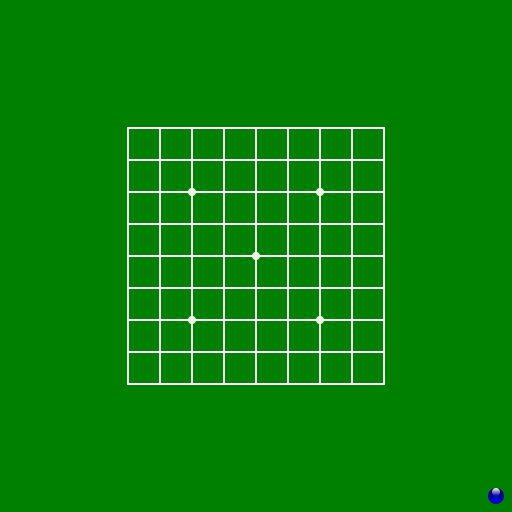
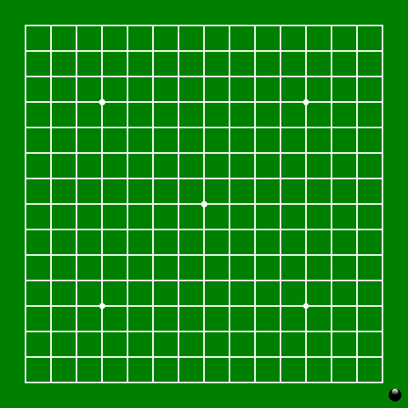

A collection of classic board games that can be played against a computer opponent.

Mostly intended for casual players, who want to try out different games. Don't expect the computer to be particularly good at any one game.

## Games included so far
### Checkers/Draughts
[Rules](https://wcdf.net/rules.htm)

### Chess
[Rules](https://handbook.fide.com/chapter/E012023)

### Go (9x9)
[Rules](https://www.cs.cmu.edu/~wjh/go/rules/Chinese.html)

### Gomoku
[Rules](https://en.wikipedia.org/wiki/Gomoku)

### Nine Men's Morris
[Rules](https://library.slmath.org/books/Book29/files/gasser.pdf)

