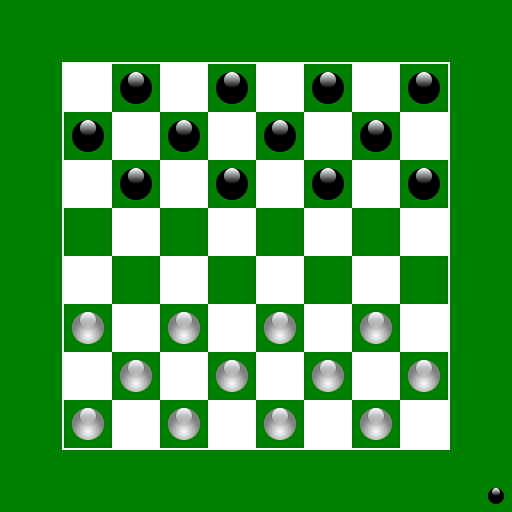

A collection of classic board games that can be played against a computer opponent.

Mostly intended for casual players, who want to try out different games. Don't expect the computer to be particularly good at any one game.

## How to play

- [Download and install a JRE](https://adoptium.net/temurin/releases/)
- [Download and unzip this project](https://github.com/Michi83/boardgamecollection/archive/refs/heads/main.zip)
- Double-click on run.bat or run.sh

## Games included so far
### Checkers/Draughts
[Rules](https://wcdf.net/rules.htm)

### Chess
[Rules](https://handbook.fide.com/chapter/E012023)

### Go (9x9)
[Rules](https://www.cs.cmu.edu/~wjh/go/rules/Chinese.html)

### Gomoku
[Rules](https://en.wikipedia.org/wiki/Gomoku)

### Nine Men's Morris
[Rules](https://library.slmath.org/books/Book29/files/gasser.pdf)

### Reversi
[Rules](https://www.worldothello.org/about/about-othello/othello-rules/official-rules/english)

### Shogi
[Rules](https://fesashogi.eu/pdf/FESA%20rules.pdf)

### Tablut
[Rules](https://en.wikipedia.org/wiki/Tafl_games#Tablut)

