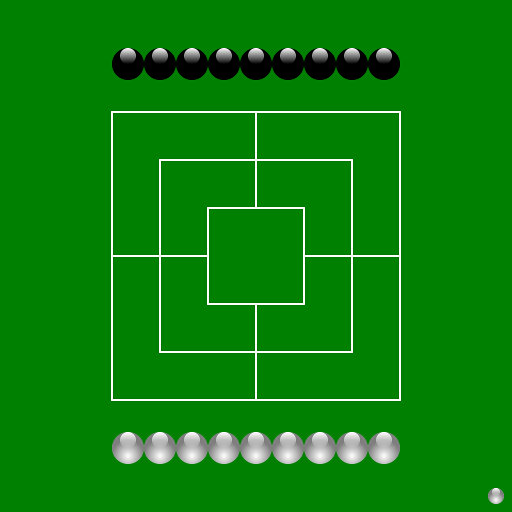

A collection of classic board games that can be played against a computer opponent.

Mostly intended for casual players, who want to try out different games. Don't expect the computer to be particularly good at any one game.

  

## How to play

- [Download and install a JRE](https://adoptium.net/temurin/releases/)
- [Download and unzip the project](https://github.com/Michi83/boardgamecollection/archive/refs/heads/main.zip)
- Execute run.bat or run.sh

## Games included so far

- Checkers/Draughts
- Chess
- Go 19×19
- Go 13×13
- Go 9×9
- Gomoku
- International Checkers/Draughts
- Nine Men's Morris
- Oware
- Reversi
- Shogi
- Tablut
- Xiangqi