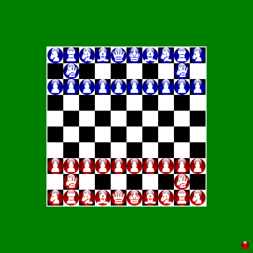

A collection of classic board games that can be played against the computer. Requires [Python](https://www.python.org/downloads/) and [Pygame](https://www.pygame.org/wiki/GettingStarted).

## Games included so far
### Caïssa Britannia
[Rules](https://www.chessvariants.com/large.dir/british.html)

### Capablanca Chess
[Rules](https://www.chessvariants.org/large.dir/capablanca.html)

### Checkers/Draughts
[Rules](https://wcdf.net/rules.htm)

### Chess
[Rules](https://handbook.fide.com/chapter/E012023)

### Grand Chess
[Rules](https://www.chessvariants.com/large.dir/freeling.html)

### Nine Men's Morris
[Rules](https://library.slmath.org/books/Book29/files/gasser.pdf)

### Reversi
[Rules](https://www.worldothello.org/about/about-othello/othello-rules/official-rules/english)

### Tic-Tac-Toe
[Rules](https://en.wikipedia.org/wiki/Tic-tac-toe)

